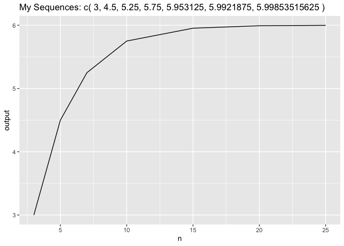

<!-- README.md is generated from README.Rmd. Please edit that file -->

# recurpkg

<!-- badges: start -->

<!-- badges: end -->

The goal of recurpkg is to calculate the sequence vector for a recursive sequence formular and possibly draw a graph for a dataset

## Installation

"This package is only available by permission of the author at

install.packages(“GitRepo Link”)

``` r
install.packages("recurpkg")
```

## Example

This is a basic example which shows you how to solve a common problem:

``` r
library(recurpkg)
## basic example code
## vector calculation
## vector length is equal to three
recur_vec(x = c(2, 4, 3), n = 3)
#> [1] 3
```

``` r
## vector length is greater than 3
recur_vec(x = c(2, 4,3,4), n = 3)
#> [1] 3
```

``` r
## vector length is equal to three and the sequence number is greater than 3
recur_vec(x = c(2, 4, 3), n = 5)
#> [1] 4.5
```

``` r
## sequence number is not an integar
recur_vec(x = c(2, 4, 3), n = 4.5)
#> [1] "the sequence number indicator must be an integer"
```

``` r
#dataset example
my_data <- tibble::tribble(
  ~x, ~y, ~z, ~n,
  2,4,3,3,
  2,4,3,5,
  2,4,3,7,
  2,4,3,10,
  2,4,3,15,
  2,4,3,20,
  2,4,3,25
)

recur_dataset(my_data)
```


