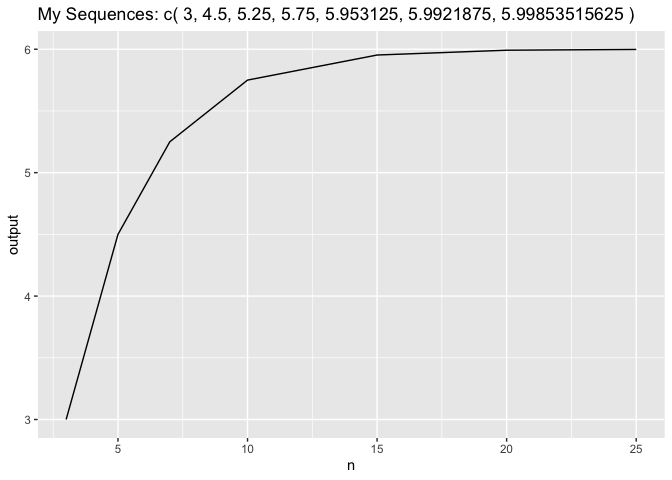

<!-- README.md is generated from README.Rmd. Please edit that file -->

# recurpkg

<!-- badges: start -->

<!-- badges: end -->

The goal of recurpkg is to calculate a sequence vector defined as
following: \(X_n\) = \(X_{n-1}\) +|\(X_{n-2} - X_{n-3\)}|/2

That is, element n is the sum of element n−1 and the absolute value of
the difference between elements n−2 and n−3 divided by two where each
element is a number. For example, if we let \(X_1\)=3, \(X_2\)=1, and
\(X_3\)=10, then \(X_4\) is \(X_4\) = 10+ |1−3|/2 =11.

If the input is a vector, then the initial three numeric values will be
taken as initial values. If the input is a dataframe, then the dataframe
should has 4 columns, while the first three columns are the initial
values of the sequence and the last columns will be the nth element of
the sequence. The output will be a plot with x axis as the sequence
position n, y axis as the sequence value.

## Installation

"This package is only available by permission of the author at

install.packages(“GitRepo Link”)

``` r
install.packages("recurpkg")
```

## Example

This is a basic example which shows you how to solve a common problem:

``` r
library(recurpkg)
## basic example code
## vector calculation
## vector length is equal to three
recur_vec(x = c(2, 4, 3), n = 3)
#> [1] 3
```

``` r
## vector length is greater than 3
recur_vec(x = c(2, 4,3,4), n = 3)
#> [1] 3
```

``` r
## vector length is equal to three and the sequence number is greater than 3
recur_vec(x = c(2, 4, 3), n = 5)
#> [1] 4.5
```

``` r
## sequence number is not an integar
recur_vec(x = c(2, 4, 3), n = 4.5)
#> [1] "the sequence number indicator must be an integer"
```

``` r
## vector contains both numeric and character values
recur_vec(x = c(2,'a',4,'b', 3), n = 4)
#> [1] 4
```

``` r
#dataset example
my_data <- tibble::tribble(
  ~x, ~y, ~z, ~n,
  2,4,3,3,
  2,4,3,5,
  2,4,3,7,
  2,4,3,10,
  2,4,3,15,
  2,4,3,20,
  2,4,3,25
)

recur_dataset(my_data)
```


